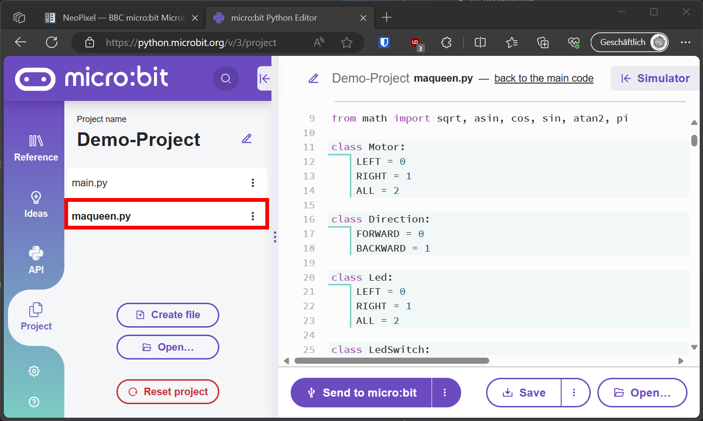

# Maqueen Plus v2
Library to control maqueen plus v2 with micro:bit and micropython.

## Installation
Copy the file `maqueenplus.py` to your project folder micro:bit.



And import the library in your code in `main.py`:

```python
from maqueen import *

motor_run(Motor.LEFT, 100)
sleep(150)
motor_stop(Motor.LEFT)
motor_run(Motor.RIGHT, 100)
sleep(150)
motor_stop(Motor.RIGHT)
```

## API

### Motor

```py
class Motor:
    LEFT = 0
    RIGHT = 1
    ALL = 2

class Direction:
    FORWARD = 0
    BACKWARD = 1
```

#### `motor_run(motor: int, speed: int, dir: int = Direction.FORWARD)`
Run the motor in the specified direction and speed.

- `speed`: -255 to 255
- `dir`: Direction.FORWARD or Direction.BACKWARD

A negative speed will run the motor in the opposite direction.

```py
# run left motor forward at 100% speed
motor_run(Motor.LEFT, 255)
# run right motor backward at 50% speed
motor_run(Motor.RIGHT, 128, Direction.BACKWARD)
# or equivalent
motor_run(Motor.RIGHT, -128)

# run both motors forward at 100% speed
motor_run(Motor.ALL, 255)
```

#### `motor_stop(motor: int = Motor.ALL)`

Stops both (default) motors or the selected motor.

```py
# stop both motors
motor_stop()
# stop left motor
motor_stop(Motor.LEFT)
```

### LED's

```py
class Led:
    LEFT = 0
    RIGHT = 1
    ALL = 2


class ColorLED:
    L1 = 0
    L2 = 1
    R2 = 2
    R1 = 3
    ALL = 4

class Color:
    RED = 0xFF0000
    ORANGE = 0xFFA500
    YELLOW = 0xFFFF00
    GREEN = 0x00FF00
    BLUE = 0x0000FF
    INDIGO = 0x4B0082
    VIOLET = 0x8A2BE2
    PURPLE = 0xFF00FF
    WHITE = 0xFFFFFF
    BLACK = 0x000000
```

#### `led_red(on: bool, led: int = Led.ALL)`

Turns on or off the red led in front of the Maqueen.

By default, it turns on or off both leds.

```py
led_red(True)
# turn off left led
led_red(False, Led.LEFT)
```

#### `led_rgb(rgb: int, led: int = ColorLED.ALL, brightness: int = _brightness)`
Turns on the RGB led in the specified color. By default the same color is used for all 4 leds.

The color leds are arranged as follows:
```
   /''''^''''\
  /  L1   R1  \
 |             |
 |L2         R2|
o|.............|o
```

```py
# turn on all leds in red
led_rgb(Color.RED)
# turn on upper left led in green
led_rgb(Color.GREEN, ColorLED.L1)
# use a custom color
led_rgb(rgb(255, 128, 0), ColorLED.R1)
# use a specific brightness [0-255]. By default, the global brightness is used.
led_rgb(Color.BLUE, brightness=50) # does not change the global brightness
```

#### `led_brightness(brightness: int)`
Sets the global brightness of the RGB leds.

```py
led_brightness(255) # full brightness
led_brightness(0) # leds off
```

#### `led_rgb_off(led: int = ColorLED.ALL)`

Sets the RGB led to black (off, `0`).

```py
led_rgb_off() # turn off all leds
led_rgb_off(ColorLED.L2) # turn off lower left led
```

#### `rgb(r: int, g: int, b: int)`
Helper function to convert a rgb color to an int

```py
rgb(255, 128, 0) # => 16744448  (its hex value is 0xFF8000)
```

### Line Tracking

```py
class LineSensor:
    SENSOR_L1 = 0
    SENSOR_M = 1
    SENSOR_R1 = 2
    SENSOR_L2 = 3
    SENSOR_R2 = 4
    ALL = 5
```

#### `line_sensor(sensor: int)`
Returns the value of the specified line tracking sensor.

```
   /''''^''''\
  /  L1 M R1  \
 |             |
 |L2         R2|
o|.............|o
```

```py
line_sensor(LineSensor.M) # => 0 or 1
```

When `LineSensor.ALL` is used, a 5-tuple with values of all sensors is returned. The order is clockwise starting with the leftmost sensor: `(L2, L1, M, R1, R2)`

```py
line_sensor(LineSensor.ALL) # => tuple of all sensors, (0, 1, 1, 0, 1)
                            # => L1, M and R2 are on the line
```

#### `line_sensor_data(sensor: int)`
Returns the raw data of the specified line tracking sensor.

```py
line_sensor_data(LineSensor.M) # => 0-1023
```

When `LineSensor.ALL` is used, a 5-tuple with values of all sensors is returned. The order is clockwise starting with the leftmost sensor: `(L2, L1, M, R1, R2)`

```py
line_sensor_data(LineSensor.ALL) # => tuple of all sensors, (12, 1023, 721, 23, 222)
                                 # => All sensors read a value between 0 and 1023
```

### Ultrasonic Sensor

#### `ultrasonic()`
Returns the distance in centimeters.

```py
ultrasonic() # => 0-500
```

When the ultrasonic sensor is not connected to the default trigger `pin13` and echo `pin14`, you can specify the pins as arguments.

```py
ultrasonic(trig=pin0, echo=pin1) # => 0-500
```

### Version
Returns the version of the maqueen platform.

```py
version() # => 'MBT0021-EN-2.1'
```

### Compass Heading
Since the compass is mounted in the maqueen such that the y-axis points upwards and the z-axis points forward, the heading calculated by the micro:bit is not correct (it assumes the y-axis points forward and the z-axis points upwards).

Therefore, a tilt-compensated compass heading is calculated using the accelerometer and magnetometer data assuming the micro:bit is mounted in the maqueen.

#### `mq_heading()`

The heading is returned in degrees between 0 and 359. The heading is calculated using the accelerometer and magnetometer data.

! Pay attention to inferring the heading while the maqueen is moving, since the motors produce magnetic noise.

```py
mq_heading() # => 0-359
```

#### `heading_diff(heading0: float, apply_window: bool = True)`

Returns the difference between the current heading and the specified heading in degrees between -180 and 180.

To get more stable results, a moving average filter is applied to the heading (default window size is 1). The window size can be changed by setting the global variable `heading_set_window_size` (see below).

```py
initial_heading = 20
# maqueen turned by 45 degrees to the right
heading_diff(initial_heading) # => 45
# maqueen now turned by 90 degrees to the left
heading_diff(initial_heading) # => -45
```
the moving average filter can be disabled by setting `apply_window` to `False`.

```py
heading_diff(initial_heading, apply_window=False) # => -45
```

#### `heading_set_window_size(size: int)`
Sets the window size of the moving average filter used to calculate the heading difference.

```py
heading_set_window_size(5) # => window size of 5
```

To disable the moving average filter, set the window size to `1`.

```py
heading_set_window_size(1) # => no moving average filter
```

## Examples
Drive forward straight, correcting the heading using the compass.

```py
from microbit import *
from maqueen import *

SPEED = 40
DT_TURN = SPEED // 10
THRESHOLD = 10
WINDOW_SIZE = 2 * THRESHOLD

motor_stop(Motor.ALL)
heading_set_window_size(WINDOW_SIZE)

display.show(Image.HAPPY)
h0 = mq_heading()
sleep(2000)
motor_run(Motor.ALL, SPEED)
sleep(200)

state = 'FORWARD'
while True:
    dh = heading_diff(h0)
    print(round(dh))
    if button_a.was_pressed():
        motor_stop()
        compass.clear_calibration()
        compass.calibrate()
    elif button_b.was_pressed():
        h0 = mq_heading()
        heading_set_window_size(WINDOW_SIZE)
        state = 'FORWARD'
    if state == 'FORWARD':
        motor_run(Motor.ALL, SPEED)
        display.show(Image.ARROW_N) # arrow forward
        if dh < -THRESHOLD:
            state = 'TURN:RIGHT'
        elif dh > THRESHOLD:
            state = 'TURN:LEFT'
    elif state == 'TURN:LEFT':
        display.show(Image.ARROW_E) # arrow left 
        motor_run(Motor.LEFT, SPEED - DT_TURN)
        motor_run(Motor.RIGHT, SPEED + DT_TURN)
        if dh <= 0:
            state = 'FORWARD'
    elif state == 'TURN:RIGHT':
        display.show(Image.ARROW_W) # arrow right 
        motor_run(Motor.LEFT, SPEED + DT_TURN)
        motor_run(Motor.RIGHT, SPEED - DT_TURN)
        if dh >= 0:
            state = 'FORWARD'
    sleep(5)
```