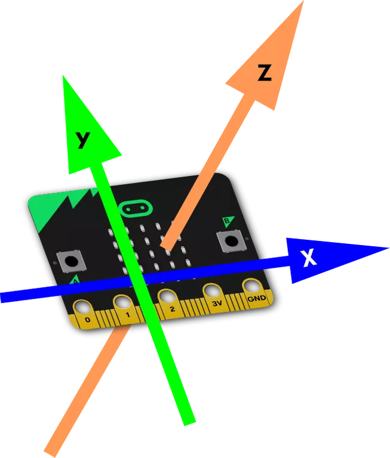

# Kompass
Der Micro\:Bit enthält einen Magnetsensor (Magnetometer), welcher die Magnetfeldstärke (µT) in drei Dimensionen misst. Mit Hilfe des Magnetometers kann die Ausrichtung des Micro\:Bit relativ zum Erdmagnetfeld bestimmt werden. Norden ist dabei dort, wo die höchste Magnetkraft gemessen wird.

Da für einen Kompass die Ausrichtung nur in der Ebene bestimmt werden soll, wird mit dem Beschleunigungssensor (Accelerometer) die Neigung des Micro\:Bit relativ zur Erdoberfläche bestimmt. Zusammen mit den Magnetometer Werten kann so die Ausrichtung mit der Funktion `heading` abgefragt werden:

```py
from microbit import *
while True:
    print('Ausrichtung: ', compass.heading())
    sleep(1000)
```

Der Micro\:Bit macht dabei die Annahme, dass die y-Achse nach vorne zeigt und die z-Achse nach oben. 



Da der Micro\:Bit aber im Maqueen so montiert ist, dass die y-Achse nach oben zeigt und die z-Achse nach vorne, ist die Annahme falsch und die Ausrichtung wird nicht mehr korrekt berechnet.

### `mq_heading()`

Gibt die Ausrichtung des Maqueen in Grad zwischen 0 und 359 zurück. Die Ausrichtung wird mit den Daten des Accelerometers und des Magnetometers berechnet.

:::danger Elektromagnetische Störungen durch die Motoren
Beachte, dass die Motoren des Maqueen elektromagnetische Störungen verursachen. Achte deshalb darauf, dass die Ausrichtung nur abgefragt wird, wenn die Drehgeschwindigkeiten der Motoren nicht verändert werden. Noch bessere Ergebnise werden erzielt, wenn die Motoren nicht laufen.
:::

```py
mq_heading() # => 0-359
```

### `heading_diff(heading0)`

Gibt die Differenz zwischen der aktuellen Ausrichtung und der angegebenen Ausrichtung ( `heading0`) in Grad zwischen -180 und 180 zurück. Um die Resultate weniger störungsanfällig zu machen, wird ein *moving average filter* angewandt (Standardfenstergrösse ist 1). Die Fenstergrösse kann mit der Funktion [`heading_set_window_size`](#heading_set_window_sizesize) geändert werden.

#### Parameter
`heading0`
: `float`
: Die Referenz-Ausrichtung in Grad zwischen 0 und 359.
`apply_window`
: *optional*
: `True` (default)
: `False`

#### Beispiel

```py
initial_heading = 20
# maqueen um 45 ° nach rechts gedreht, d.h. die Ausrichtung ist jetzt 65 °
heading_diff(initial_heading) # => 45
# maqueen nun um 90 ° nach links gedreht, d.h. die Ausrichtung ist nun bei -25 °
heading_diff(initial_heading) # => -45
```

Um die aktuelle Messung ohne Filterung zu erhalten, kann `apply_window` auf `False` gesetzt werden.

```py
heading_diff(initial_heading, apply_window=False) # => -45
```

### `heading_set_window_size(size)` {#heading_set_window_sizesize}
Setzt die Grösse des Filterfensters, welches bei der Berechnung der Ausrichtungsdifferenz benutzt wird.

```py
heading_set_window_size(5) # => window size of 5
```

Um den Filter zu deaktivieren, kann die Fenstergrösse auf `1` gesetzt werden.

```py
heading_set_window_size(1) # => no moving average filter
```