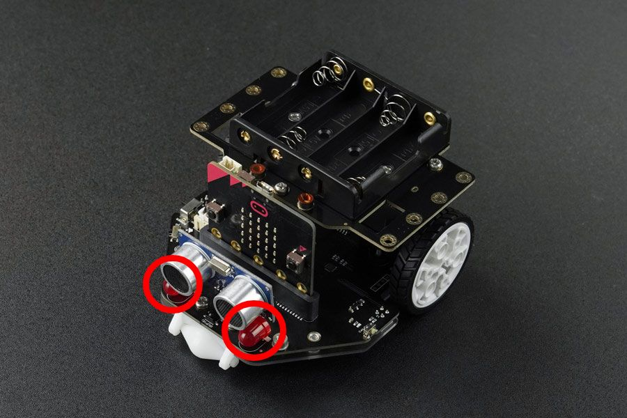

# LED's rot



Für die Steuerung der beiden roten LED's kann die Funktion `led_red` verwendet werden.


## API
Für die Farb-LED's können folgende Konstanten benutzt werden:

```py
class Led:
    LEFT = 0
    RIGHT = 1
    ALL = 2
```


### `led_red(on)`

Schaltet die rote LED vorne am Maqueen ein oder aus.

#### Parameter
- `on: bool`: `True` oder `False` um die beiden LED ein- oder auszuschalten
- `led: int`: *optional*, `Led.LEFT`, `Led.RIGHT` oder `Led.ALL`

#### Beispiel

```py
led_red(True) # schaltet beide roten LED's ein

# oder einzeln...
led_red(False, Led.LEFT) # schaltet die linke LED aus
```