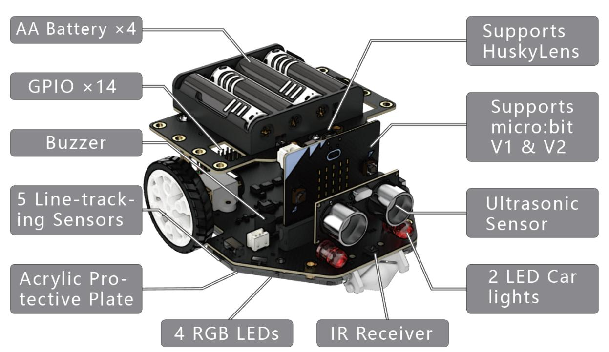

# Maqueen Plus V2.0

Eine Bibliothek zum Steuern und Auslesen von Sensordaten beim **Maqueen Plus V2.0** mit Micro:bit und **MicroPython**.



## Installation

Auf https://python.microbit.org/v/3 finden Sie eine Online-IDE für MicroPython auf dem Micro:bit.

Kopieren Sie die Datei `maqueenplus.py` in den Projektordner, sie kann dann direkt importtiert und gebraucht werden.


```py
from maqueen import *

motor_run(Motor.LEFT, 100)
sleep(150)
motor_stop(Motor.LEFT)
motor_run(Motor.ALL, 100)
```