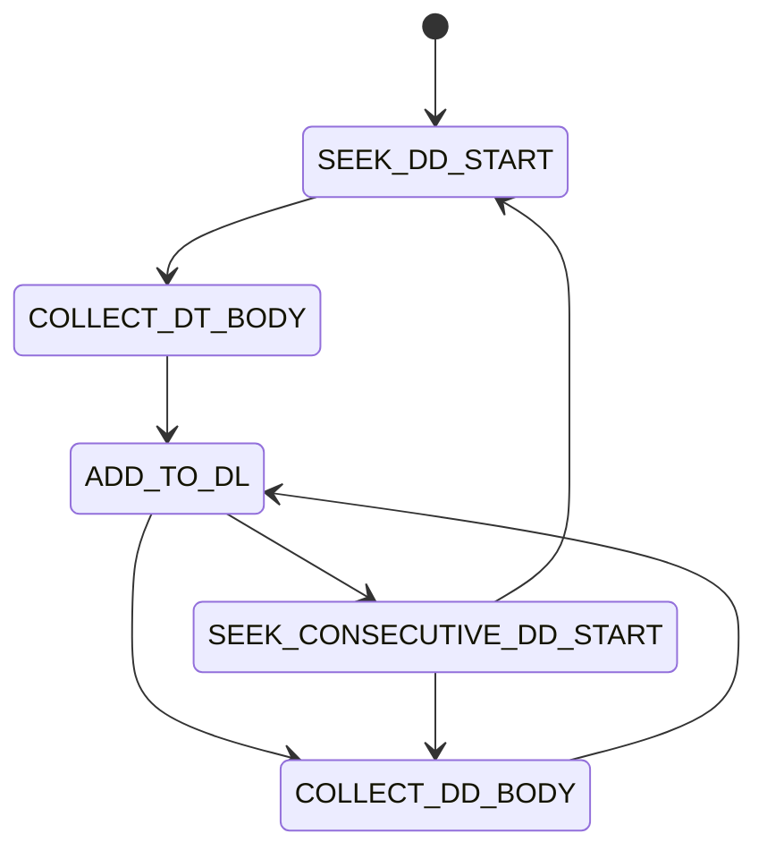

# remark-deflist

Transforms the mdast ast to support definition lists.

```md
Term 1
:   Definition 1
Term 2
:   Definition 2
:   with lazy continuation
```

will be transformed to

<details>
<summary>MDAST</summary>

```json
{
  "type": "root",
  "children": [
    {
      "type": "mdxJsxFlowElement",
      "name": "dl",
      "attributes": [],
      "children": [
        {
          "type": "mdxJsxFlowElement",
          "name": "dt",
          "attributes": [],
          "children": [
            {
              "type": "paragraph",
              "children": [
                {
                  "type": "text",
                  "value": "Term 1"
                }
              ]
            }
          ],
          "data": {
            "_mdxExplicitJsx": true
          }
        },
        {
          "type": "mdxJsxFlowElement",
          "name": "dd",
          "attributes": [],
          "children": [
            {
              "type": "paragraph",
              "children": [
                {
                  "type": "text",
                  "value": "Definition 1"
                }
              ]
            }
          ],
          "data": {
            "_mdxExplicitJsx": true
          }
        },
        {
          "type": "mdxJsxFlowElement",
          "name": "dt",
          "attributes": [],
          "children": [
            {
              "type": "paragraph",
              "children": [
                {
                  "type": "text",
                  "value": "Term 2"
                }
              ]
            }
          ],
          "data": {
            "_mdxExplicitJsx": true
          }
        },
        {
          "type": "mdxJsxFlowElement",
          "name": "dd",
          "attributes": [],
          "children": [
            {
              "type": "paragraph",
              "children": [
                {
                  "type": "text",
                  "value": "Definition 2"
                }
              ]
            }
          ],
          "data": {
            "_mdxExplicitJsx": true
          }
        },
        {
          "type": "mdxJsxFlowElement",
          "name": "dd",
          "attributes": [],
          "children": [
            {
              "type": "paragraph",
              "children": [
                {
                  "type": "text",
                  "value": "with lazy continuation"
                }
              ]
            }
          ],
          "data": {
            "_mdxExplicitJsx": true
          }
        }
      ],
      "data": {
        "_mdxExplicitJsx": true
      }
    }
  ],
  "position": {
    "start": {
      "line": 1,
      "column": 1,
      "offset": 0
    },
    "end": {
      "line": 7,
      "column": 1,
      "offset": 76
    }
  }
}
```

</details>

or in html-output

```html
<dl>
    <dt>
        Term 1
    </dt>
    <dd>
        Definition 1
    </dd>
    <dt>
        Term 2
    </dt>
    <dd>
        Definition 2
    </dd>
    <dd>
        with lazy continuation
    </dd>
</dl>
```

## Design

The plugin works based on a state machine:


