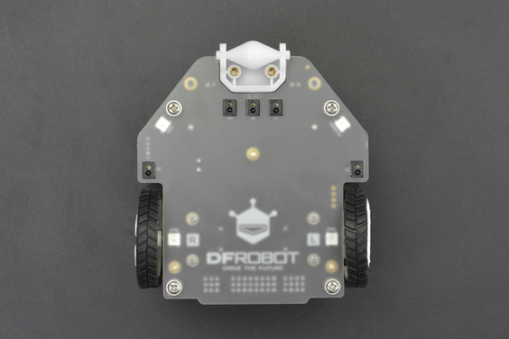
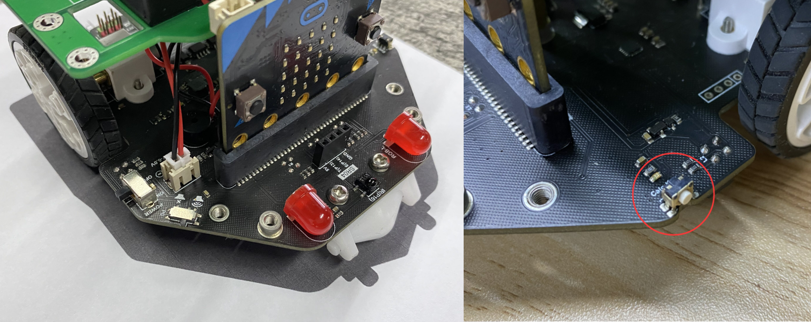

# Liniensensor



Für die Steuerung des Liniensensors kann die Funktion `line_sensor` verwendet werden.

## API

Für die Liniensensoren können folgende Konstanten benutzt werden:

```py
class LineSensor:
    L1 = 0
    M = 1
    R1 = 2
    L2 = 3
    R2 = 4
```

### `line_sensor(sensor)`
Gibt für den angegebenen Liniensensor an, ob er Schwarz (=`1`) oder Weiss (=`0`) sieht.

Aus der Vogelperspektive sind die Sensoren wie folgt angeordnet:

```
   /''''^''''\
  /  L1 M R1  \
 |             |
 |L2         R2|
o|.............|o
```

#### Parameter
`sensor: int`
: `LineSensor.L1`
: `LineSensor.M`
: `LineSensor.R1`
: `LineSensor.L2`
: `LineSensor.R2`


#### Beispiel

Den mittleren Sensor abfragen:

```py
line_sensor(LineSensor.M) # => 0 oder 1
```

### `line_sensor_all()`

Mit `line_sensor_all` wird ein 5-Tupel mit den Werten von allen Fünf Liniensensoren zurückgegeben. Die Reihenfolge ist im Uhrzeigersinn, beginnend mit dem linken Sensor: `(L2, L1, M, R1, R2)`

#### Beispiel

```py
line_sensor_all()   # => Tupel aller Sensorwerte, (0, 1, 1, 0, 1)
                    #    -> L1, M und R2 sind auf der Linie
```

### `line_sensor_data(sensor)`
Gibt die Rohdaten des angegebenen Liniensensors zurück. Je näher der Sensorwert bei `0` ist, desto dunkler ist die gemessene Farbe. Je näher der Wert bei `255` ist, desto heller ist die gemessene Farbe. Für die Unterscheidung von Schwarz und Weiss kann bspw. folgender Schwellwert verwendet werden: 

schwarz
: `< 100`
weiss
: `> 100`

#### Parameter
`sensor: int`
: `LineSensor.L1`
: `LineSensor.M`
: `LineSensor.R1`
: `LineSensor.L2`
: `LineSensor.R2`

#### Beispiel
```py
line_sensor_data(LineSensor.M) # => 0-256
```

### `line_sensor_data_all()`
Mit der Funktion `line_sensor_data_all` wird ein 5-Tupel mit den Rohwerten von allen 5 Liniensensoren zurückgegeben. Die Reihenfolge ist im Uhrzeigersinn, beginnend mit dem linken Sensor: `(L2, L1, M, R1, R2)`

#### Beispiel

```py
line_sensor_data_all()  # => Tupel aller Sensorwerte (12, 130, 50, 72, 77)
                        # => Alle Sensoren messen Werte zwischen 0 und 255
```

### Kalibrierung der Liniensensoren

Die Liniensensoren wurden im Werk kalibriert. Sollte die Kalibrierung nicht mehr präzise sein, können die Sensoren neu kalibriert werden.
1. Maqueen auf einer schwarzen Fläche positionieren (bspw. auf der Rückseite der beigelegten *Track Map*) 
2. Den *Calibration Key* **5 Sekunden** gedrückt halten


